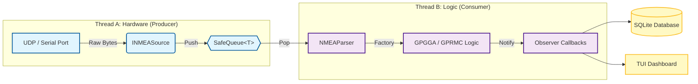

# **NMEA-0183 Navigation Data Parser & Integration System**

## **Executive Summary**

This project is a modular, fault-tolerant C++ library designed to ingest, validate, parse, persist, and visualize **NMEA-0183** marine navigation data.  
It represents a complete Embedded Systems software stack. The system has evolved from a simple string parser into a robust **Real-Time Engine** capable of handling high-frequency data bursts (10Hz+) without packet loss. It features a **Hardware Abstraction Layer (HAL)**, a **Producer-Consumer Architecture** for concurrency, an embedded **SQLite Database** for tracking, and a professional **Text User Interface (TUI)**.  
The project employs modern DevOps practices, including **CMake** for cross-platform builds, **GoogleTest** for unit testing, and **Docker** for reproducible deployments via multi-stage builds.
## **System Architecture**

The system is built on seven core architectural pillars:

1. **The Abstraction Layer (INMEASource):** Uses Dependency Injection to treat Serial ports and UDP sockets identically.  
2. **The Gatekeeper (NMEAParser):** A centralized factory that validates checksums and dispatches logic.  
3. **The Strategies (INMEASentence):** Polymorphic classes that handle specific sentence logic (GPGGA vs GPRMC).  
4. **The Event Bus (Observer Pattern):** Allows multiple systems to subscribe to GPS updates via callbacks.  
5. **The Shock Absorber (Concurrency):** A Thread-Safe Queue separating Ingestion from Processing.  
6. **The Black Box (Persistence):** An RAII-compliant SQLite wrapper that securely logs voyage data to disk.  
7. **The Face (User Interface):** An NCurses-based dashboard that renders live data without console scrolling.


## **Technical Capabilities**

### **1\. High-Performance Concurrency**

* **Producer-Consumer Model:** Implements a multi-threaded architecture where **Thread A** handles high-speed IO (Ingestion) and **Thread B** handles CPU-intensive Logic/IO (Processing).  
* **Backpressure Management:** Verified via stress testing to handle **10Hz** input streams even when downstream consumers lag (simulated 2Hz throughput), ensuring **Zero Packet Loss**.

### **2\. DevOps & Infrastructure**

* **Dockerized Deployment:** Utilizes a **Multi-Stage Dockerfile** based on Alpine Linux to compile the application and ship a lightweight (\<15MB) runtime container.  
* **Modern Build System:** Migrated from Makefiles to **CMake** with FetchContent for automatic dependency management (GoogleTest).  
* **Automated Testing:** Comprehensive **GoogleTest** suite covering Factory logic, Checksum validation, and Concurrency safety.

### **3\. User Interface (TUI)**

* **NCurses Integration:** Replaces scrolling console logs with a static, professional Terminal User Interface.  
* **Thread Isolation:** Manages console access carefully to prevent "garbled text" race conditions between logging threads and drawing threads.

### **4\. Data Persistence (SQLite)**

* **Embedded Database:** Integrates libsqlite3 using **Prepared Statements** for security and speed.

## **Getting Started**

### **Prerequisites**

* C++17 Compiler  
* CMake 3.14+  
* Docker (Optional)

### **Option A: Native Build (CMake)**

\# 1\. Generate Build Files  
```bash
mkdir build && cd build  
cmake ..
```
\# 2\. Compile  
```bash
make
```
\# 3\. Run the Application  
```bash
./nmea\_app
```
\# 4\. Run Unit Tests  
```bash
ctest \--output-on-failure
```
### **Option B: Docker Build (Containerized)**

Run the application in an isolated Alpine Linux environment without installing local libraries.  
\# 1\. Build the Image  
```bash
docker build \-t nmea\_engine:v1.0 .
```
\# 2\. Run the Container  
\# \-it: Interactive TTY (Needed for TUI)  
\# \-v: Mount current directory to save DB file to host  
```bash
docker run \-it \-v $(pwd):/app nmea\_engine:v1.0
```
## **🛠️ Testing with Hardware Simulation**

### **Scenario A: Simulating Network Data (UDP)**

To simulate a yacht broadcasting GPS data over WiFi:

1. Start the application and select **Mode 1 (UDP)**.  
2. Run netcat in a separate terminal to fire a packet:  
   ```bash
   echo "\\$GPGGA,123519,4807.038,N,01131.000,E,1,08,0.9,545.4,M,46.9,M,,\*47" | nc \-u 127.0.0.1 10110
    ```
### **Scenario B: Stress Testing (Concurrency)**

To verify the Producer-Consumer queue prevents data loss during bursts:

1. Modify main.cpp to sleep in the consumer thread.  
2. Run the firehose script:  
```bash
while true; do echo "\\$GPGGA,..." | nc \-u \-w 0 127.0.0.1 10110; sleep 0.1; done
```
3. **Result:** Input is ingested instantly (\[RX\]), while processing happens at its own pace, proving buffer efficacy.

## **Project Timeline (SDLC Simulation)**

This project was developed following a strict Agile workflow with atomic commits:

* **Phase 1-5:** Core Logic & Driver Implementation.  
* **Phase 6:** **Architectural Refactoring** \-\> Migrated to Factory Pattern.  
* **Phase 7:** **System Integration** \-\> Serial and UDP HAL.  
* **Phase 8:** **Event-Driven Architecture** \-\> Observer Pattern.  
* **Phase 10:** **Concurrency** \-\> Producer-Consumer Queue.  
* **Phase 11:** **Persistence** \-\> SQLite Integration.  
* **Phase 12:** **User Interface** \-\> NCurses Dashboard.  
* **Phase 13:** **Modernization** \-\> Migration to CMake & GoogleTest.  
* **Phase 14:** **DevOps** \-\> Docker Containerization.

Author: Umar Arshid