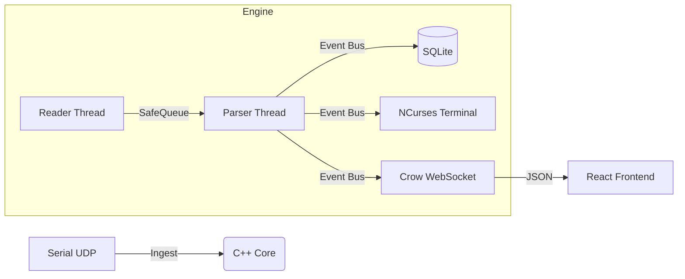

# **NMEA Navigation Engine**

**A high-performance, fault-tolerant embedded system for ingesting, persisting, and visualizing NMEA-0183 navigation data.**  
This engine decouples high-speed hardware ingestion from downstream logic using a thread-safe Producer-Consumer architecture. It serves as a complete bridge between raw marine hardware (Serial/UDP) and modern visualization interfaces (TUI/Web).

## **Key Capabilities**

* **Real-Time Ingestion:** Zero-packet-loss handling of 10Hz+ data bursts via **Producer-Consumer** concurrency.  
* **Dual Visualization:**  
  * **Local:** Low-latency **NCurses TUI** for headless devices.  
  * **Remote:** Embedded **WebSocket Server** hosting a **React/Leaflet** map dashboard.  
* **Hardware Abstraction:** Seamless switching between **UART/Serial** (4800 baud) and **UDP Network** streams.  
* **Persistence:** Automated voyage logging to embedded **SQLite** with RAII resource management.  
* **Infrastructure:** Multi-stage **Docker** build (\<15MB image) and **GoogleTest** verification suites.

## **Architecture**

## **Quick Start**

### **Option A: Docker (Recommended)**

Run the full stack (Engine \+ Web Server) in a lightweight Alpine container.  
Build the image
```bash
docker build -t nmea_final .
```
Run (Map port 8080 for Web UI, Mount current dir for DB persistence)
Note: We mount to /data to avoid overwriting the binary in /app
```bash
docker run -it -p 8080:8080 -v $(pwd):/data nmea_final
```
### **Option B: Native Build (CMake)**

Requires C++17, CMake 3.14+, SQLite3, and NCurses.  
\# 1\. Build React Frontend  
```bash
cd frontend && npm install && npm run build && cd ..
```
\# 2\. Build C++ Engine  
```bash
mkdir build && cd build  
cmake ..  
make
```
\# 3\. Run  
```bash
./nmea\_app
```
## **Usage**

Upon startup, the engine requests a data source configuration:

1. **Select Source:**  
   * \[1\] UDP: Listens on Port 10110 (Standard Marine WiFi).  
   * \[2\] Serial: Connects to specified device path (e.g., /dev/ttyUSB0) at 4800 8N1.  
2. **Interface Launch:**  
   * The terminal immediately switches to the **TUI Dashboard**.  
   * The Web Dashboard becomes available at http://localhost:8080.
3. **Shutdown: **
   * Press q to safely stop threads, close the database, and restore the terminal

### **Simulation Tools**

To test without physical hardware, use netcat to inject NMEA sentences:  
\# Simulate a moving vessel via UDP  
```bash
while true; do echo "\\$GPGGA,123519,4807.038,N,01131.000,E,1,08,0.9,545.4,M,46.9,M,,\*47" | nc \-u \-w 0 127.0.0.1 10110; sleep 0.1; done
```
Or run 
```bash
./firehose.sh
``` 
## **Engineering Documentation**

This tool was built to demonstrate advanced systems engineering patterns including Factory factories, Observer event buses, and lock-free concurrency.

* **Development Log:** See ProjectJourney.md for a detailed breakdown of the architectural evolution.